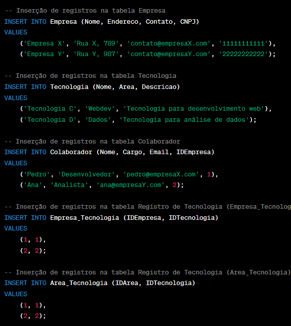

# proj_individual_mod03

1. Entidades:

   - Empresa
   - Tecnologia
   - Colaborador
   - Área
   - Empresa_Tecnologia (relacionamento entre Empresa e Tecnologia)
   - Área_Tecnologia (relacionamento entre Área e Tecnologia)

2. Principais campos e tipos de dados:

   Empresa:

   - ID: Identificador único da empresa (inteiro).
   - Nome: Nome da empresa (string).
   - Endereço: Endereço da empresa (string).
   - Contato: Informações de contato da empresa (string).
   - CNPJ: CNPJ da empresa (string).

   Tecnologia:

   - ID: Identificador único da tecnologia (inteiro).
   - Nome: Nome da tecnologia (string).
   - Área: Área da tecnologia (string).
   - Descrição: Descrição da tecnologia (string).

   Colaborador:

   - ID: Identificador único do colaborador (inteiro).
   - Nome: Nome do colaborador (string).
   - Cargo: Cargo do colaborador na empresa (string).
   - Email: Email do colaborador na empresa (string).
   - ID da Empresa: Referência ao ID da empresa em que o colaborador trabalha (inteiro).

   Empresa_Tecnologia:

   - ID: Identificador único do registro (inteiro).
   - ID da Empresa: Referência ao ID da empresa (inteiro).
   - ID da Tecnologia: Referência ao ID da tecnologia (inteiro).

   Área_Tecnologia:

   - ID: Identificador único do registro (inteiro).
   - ID da Área: Referência ao ID da área (inteiro).
   - ID da Tecnologia: Referência ao ID da tecnologia (inteiro).

3. Relacionamentos:

   - Uma Empresa pode ter várias Tecnologias (relacionamento de muitos para muitos).
   - Uma Tecnologia pode estar em várias Empresas (relacionamento de muitos para muitos).
   - Uma Área pode ter várias Tecnologias (relacionamento de muitos para muitos).
   - Uma Tecnologia pode estar em várias Áreas (relacionamento de muitos para muitos).
   - Uma Empresa pode ter vários Colaboradores (relacionamento de 1 para muitos).

4. Exemplo de registros para cada entidade:

